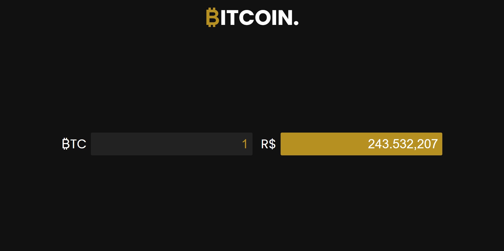

# Bitcoin coverter
App that converts bitcoin in brazilian real

[DEMO](https://gustavokuhl-cryptoconverter.netlify.app/)

## Index
 * [Concept](#Concept)
 * [Status](#Status)
 * [Techs](#Techs)
 * [Learnings](#Learnings)
 * [Author](#Author)

### Concept
The idea of this project was thinked because of blockchain's and cryptocurrency's fame.

You just need to insert how many bitcoins you'd like to convert and then the application will make a connection with blockchain's API to get the cryptocurrency value to convert to brazilian real.

### Status
Completed, but I would like to make some improvements.

### Techs
- React.js
- Styled Components

## Learnings
In this project I learned about API connection, react hooks and JSX.

## Authorship
Developed by Gustavo Kuhl.

- Gmail: gustavo.dev92@gmail.com
- [LinkedIn](https://www.linkedin.com/in/gustavo-kuhl/)